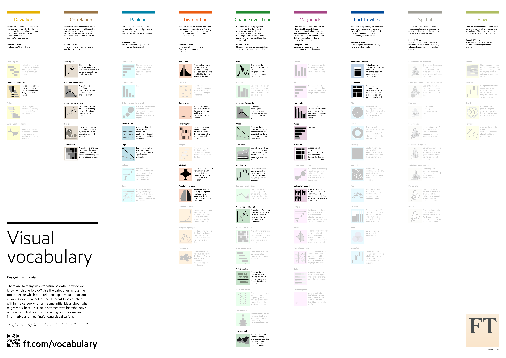

# Projet-Professionnel-ENSAI

## Grammaire appliquée à la datavisualisation

#### Mise en oeuvre du FT Visual Vocab avec Vega-Lite

Ressources :

- Document de travail de l'INSEE. Guide de sémiologie graphique, DDAR :  
  https://insee.fr/fr/statistiques/fichier/version-html/3640213/H2018-03_GuideSemioGraphique4.pdf
- Projet Github Visual Vocab du Financial Times : https://ft.com/vocabulary
- Site internet de Vega-Lite : https://vega.github.io/vega-lite/
- Visual Vocab en Vega : https://gramener.github.io/visual-vocabulary-vega/

[Notre support de soutenance](https://slides.com/p-titkoala/deck-1/fullscreen)
